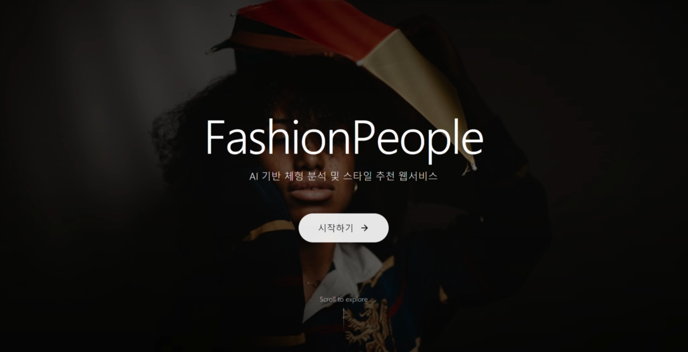

<h1 align="center">FashionPeople</h1>


<p align="center">
  
</p>

<p align="center">
  
  
  
  
  
  
</p>


## 1. 프로젝트 소개

**FashionPeople**은 사용자가 업로드한 정면·측면 이미지를 분석하여 신체 좌표를 추출하고, 체형 데이터를 기반으로 **AI 스타일 추천**과 **3D 아바타 피팅**을 제공하는 웹 기반 개인 맞춤형 패션 분석 서비스입니다.

온라인 의류 쇼핑에서는 브랜드마다 사이즈 기준이 다르고, 사용자는 실제로 옷을 입어보기 전까지 자신에게 맞는 핏을 정확히 예측하기 어렵습니다. 특히 같은 사이즈의 의류라도 사람마다 어깨 너비, 허리 비율, 상체와 하체 길이, 팔 길이 등이 다르기 때문에 실제 착용감은 크게 달라질 수 있습니다.

FashionPeople은 이러한 문제를 해결하기 위해 사용자의 이미지에서 직접 신체 좌표를 추출하고, 이를 체형 분석 데이터로 변환하여 추천 시스템과 3D 피팅 기능에 연결합니다.

---

## 2. 개발 배경

기존 온라인 쇼핑몰은 주로 다음과 같은 방식으로 의류를 추천합니다.

```text
사이즈표 기반 추천
사용자 리뷰 기반 추천
구매 이력 기반 추천
인기 상품 기반 추천
```

하지만 이러한 방식은 사용자의 실제 신체 비율을 직접 반영하지 못한다는 한계가 있습니다.

FashionPeople은 단순한 상품 추천이 아니라, 사용자의 신체 데이터를 기반으로 체형을 분석하고, 분석 결과를 바탕으로 스타일 추천과 3D 아바타 피팅을 제공하는 것을 목표로 합니다.

```text
기존 방식
사이즈표 / 리뷰 / 구매 이력 중심 추천

FashionPeople
사용자 신체 좌표 / 체형 비율 / AI 추천 / 3D 아바타 기반 피팅
```

---

## 3. 서비스 동작 흐름

```text
사용자 정면·측면 이미지 업로드
        ↓
FastAPI 서버에서 이미지 수신
        ↓
OpenCV + MediaPipe Pose로 신체 좌표 추출
        ↓
front.json / side.json 생성
        ↓
신체 길이 및 비율 계산
        ↓
body_result.json 생성
        ↓
체형 분류
        ↓
AI 스타일 추천
        ↓
3D 아바타 체형 반영
        ↓
프론트엔드 결과 화면 출력
```

---

## 4. 핵심 기능

### 4.1 이미지 업로드 기반 체형 분석

사용자는 휴대폰으로 촬영한 정면 이미지와 측면 이미지를 프론트엔드에서 업로드합니다.

서버는 업로드된 이미지를 `front.jpg`, `side.jpg` 형태로 저장하고, OpenCV와 MediaPipe Pose를 활용하여 신체 관절 좌표를 추출합니다.

---

### 4.2 MediaPipe Pose 기반 신체 좌표 추출

MediaPipe Pose는 사람의 신체를 총 33개의 랜드마크 좌표로 인식할 수 있습니다.

각 좌표는 다음 정보를 포함합니다.

```text
x, y, z, visibility
```

추출된 좌표는 정면과 측면 이미지 기준으로 분리되어 저장됩니다.

```text
front.json
side.json
```

이 좌표 데이터는 이후 신체 길이 계산, 체형 분류, AI 추천, 3D 아바타 변형에 활용됩니다.

---

### 4.3 체형 분석 데이터 생성

서버는 추출된 좌표를 기반으로 주요 신체 치수와 비율을 계산합니다.

```text
shoulder_width        어깨 너비
waist_width           허리 너비
hip_width             골반 너비
arm_length            팔 길이
upper_body_length     상체 길이
lower_body_length     하체 길이
upper_lower_ratio     상체/하체 비율
shoulder_waist_ratio  어깨/허리 비율
body_type             체형 분류 결과
```

최종 분석 결과는 `body_result.json`으로 저장됩니다.

`body_result.json`은 프로젝트의 핵심 데이터이며, 체형 분류, AI 추천, 3D 아바타 변형 기능에서 공통으로 사용됩니다.

---

### 4.4 체형 분류

분석된 신체 데이터를 기반으로 사용자의 체형을 분류합니다.

체형 분류에는 다음과 같은 수치가 활용됩니다.

```text
어깨-허리 비율
상체-하체 비율
팔 길이 비율
골반 너비
허리 너비
```

예를 들어 어깨와 허리의 비율을 비교하여 상체가 강조되는 체형인지 판단하고, 상체와 하체 길이의 비율을 비교하여 전체적인 신체 균형을 분석합니다.

---

### 4.5 AI 스타일 추천

체형 분류 결과는 AI 추천 기능으로 전달됩니다.

AI는 이미지를 직접 분석하는 것이 아니라, 서버에서 계산된 체형 데이터와 분류 결과를 바탕으로 스타일 추천 문장을 생성합니다.

추천 결과에는 다음과 같은 내용이 포함될 수 있습니다.

```text
추천 스타일
추천 아이템
피해야 할 스타일
스타일링 팁
체형별 코디 방향
```

이 구조를 통해 사용자는 단순한 상품 추천이 아니라, 자신의 체형에 맞는 스타일 방향을 확인할 수 있습니다.

---

### 4.6 3D 아바타 기반 피팅

3D 아바타 기능은 사용자의 체형 데이터를 시각적으로 확인하기 위한 기능입니다.

Blender를 활용하여 기본 아바타 모델을 구성하고, Mixamo를 통해 리깅을 적용합니다. 이후 Shape Key와 Morph Target 방식을 활용하여 사용자의 체형 데이터에 따라 아바타를 변형할 수 있도록 설계합니다.

```text
body_result.json
        ↓
체형 수치 매핑
        ↓
Shape Key / Morph Target 적용
        ↓
사용자 체형 기반 3D 아바타 생성
        ↓
Three.js 기반 웹 렌더링
```

웹 환경에서는 Three.js를 사용하여 GLB 형식의 3D 아바타를 렌더링합니다.

---

## 5. 시스템 구조

FashionPeople은 크게 **Frontend**, **Backend Server**, **AI Recommendation**, **3D Avatar**, **Database** 구조로 구성됩니다.

```text
Frontend
  └─ 이미지 업로드
  └─ 체형 분석 결과 출력
  └─ AI 추천 결과 표시
  └─ 3D 아바타 피팅 화면 제공

Backend Server
  └─ 이미지 업로드 API
  └─ OpenCV / MediaPipe 기반 체형 분석
  └─ JSON 분석 결과 생성
  └─ 추천 및 아바타 기능과 데이터 연동
  └─ DB 저장 및 조회 처리

AI Recommendation
  └─ 체형 분류 결과 기반 스타일 추천
  └─ 추천 아이템 / 피해야 할 스타일 / 스타일링 팁 생성

3D Avatar
  └─ Blender 기반 기본 아바타 제작
  └─ Mixamo 리깅 적용
  └─ Shape Key / Morph Target 기반 체형 변형
  └─ Three.js 기반 웹 렌더링

Database
  └─ 사용자 세션 관리
  └─ 체형 분석 결과 저장
  └─ 의류 정보 관리
  └─ 추천 결과 저장
  └─ 피팅 결과 저장
```

---

## 6. 데이터 흐름

```text
front.jpg / side.jpg
        ↓
MediaPipe Pose
        ↓
front.json / side.json
        ↓
신체 길이 및 비율 계산
        ↓
body_result.json
        ↓
체형 분류
        ↓
AI 추천 결과
        ↓
3D 아바타 변형
        ↓
결과 화면 출력
```

---

## 7. 사용 기술

### Frontend

```text
React
TypeScript
Three.js
HTML / CSS
```

### Backend

```text
Python
FastAPI
OpenCV
MediaPipe
Pydantic
```

### AI / Recommendation

```text
MediaPipe Pose
Rule-based Body Type Classification
AI API-based Style Recommendation
```

### 3D

```text
Blender
Mixamo
Three.js
GLB
Shape Key
Morph Target
```

### Database

```text
MySQL
MySQL Workbench
```

### Version Control

```text
Git
GitHub
```

---

## 8. 데이터베이스 구조

DB는 MySQL을 사용합니다.

DB 스키마 파일은 다음 위치에 있습니다.

```text
db/schema.sql
```

주요 테이블은 다음과 같습니다.

```text
guest_session
body_analysis
clothing_library
recommendation_result
fitting_result
```

### 테이블 역할

```text
guest_session
- 사용자 세션 정보 저장
- session_id 기준으로 분석 결과 구분

body_analysis
- 신체 분석 결과 저장
- 어깨 너비, 허리 너비, 골반 너비, 신체 비율, 체형 분류 결과 저장

clothing_library
- 의류 정보 저장
- 의류 이름, 카테고리, 핏 유형, 색상, 모델 경로 관리

recommendation_result
- AI 스타일 추천 결과 저장
- 추천 스타일, 추천 아이템, 스타일링 설명 저장

fitting_result
- 3D 피팅 결과 및 아바타 결과 저장
- 아바타 모델 경로, 피팅 결과 경로 저장
```

---

## 9. 프로젝트 구조

```text
PCRS/
├─ backend/
│  ├─ server/
│  │  ├─ main.py
│  │  ├─ analyzer.py
│  │  └─ ...
│  └─ requirements.txt
│
├─ frontend/
│  ├─ src/
│  ├─ package.json
│  └─ ...
│
├─ db/
│  └─ schema.sql
│
├─ docs/
│  ├─ presentation.html
│  ├─ demo-video.mp4
│  └─ preview.png
│
├─ raspberry_pi/
│  └─ capture_and_send.py
│
└─ README.md
```

---

## 10. 주요 API

| 구분           | Method      | Endpoint                | 설명                          |
| ------------ | ----------- | ----------------------- | --------------------------- |
| 서버 상태 확인     | GET         | `/`                     | 서버 기본 상태 확인                 |
| 헬스 체크        | GET         | `/health`               | 서버 실행 상태 확인                 |
| 이미지 업로드 및 분석 | POST        | `/upload-image`         | 정면·측면 이미지를 업로드하고 체형 분석 수행   |
| 분석 결과 조회     | GET         | `/result/{session_id}`  | 세션 ID 기준 체형 분석 결과 조회        |
| AI 추천 요청     | GET 또는 POST | `/recommend`            | 체형 분석 결과 기반 스타일 추천 생성       |
| 3D 피팅 결과 조회  | GET         | `/fitting/{session_id}` | 세션 ID 기준 3D 아바타 또는 피팅 결과 조회 |

---

## 11. 발표 자료 및 시연 영상

### 발표 자료

[presentation.html](docs/presentation.html)

### 시연 영상

[demo-video.mp4](docs/demo-video.mp4)

시연 영상에는 다음 흐름이 포함됩니다.

1. FastAPI 서버 실행
2. 프론트엔드 또는 Swagger 접속
3. 정면·측면 이미지 업로드
4. MediaPipe 기반 신체 좌표 추출
5. `front.json`, `side.json`, `body_result.json` 생성 확인
6. 체형 분석 결과 확인
7. AI 추천 또는 3D 아바타 연동 결과 확인

---

## 12. 현재 구현 범위

```text
휴대폰 이미지 업로드 기반 체형 분석
MediaPipe Pose 기반 33개 관절 좌표 추출
신체 길이 및 비율 계산
JSON 기반 분석 결과 저장
체형 분류 및 AI 추천 연동
3D 아바타 피팅 구조 설계 및 연동
MySQL DB 스키마 설계
프론트엔드 결과 화면 구성
```

---

## 13. 향후 확장 방향

```text
Raspberry Pi 카메라와 프론트엔드 촬영 버튼 연동
브랜드별 의류 실측 데이터 연동
3D 아바타 체형 반영 정확도 개선
AI 추천 결과 고도화
실제 쇼핑몰 상품 데이터 연동
모바일 웹 및 오프라인 키오스크 확장
```

---

## 14. 프로젝트 의의

FashionPeople은 기존 쇼핑몰의 단순 사이즈 추천 방식에서 벗어나, 사용자의 신체 데이터를 직접 분석하여 추천과 피팅에 활용한다는 점에서 차별성을 가집니다.

특히 체형 분석 데이터를 JSON 형태로 구조화함으로써, 프론트엔드, 백엔드, AI 추천, 3D 아바타 기능이 동일한 데이터를 기반으로 연결될 수 있도록 설계했습니다.

이를 통해 온라인 의류 쇼핑에서 발생하는 사이즈 선택의 불확실성을 줄이고, 사용자에게 더 개인화된 의류 선택 경험을 제공하는 것을 목표로 합니다.

---

## 한 줄 소개

**FashionPeople은 사용자의 신체 데이터를 기반으로 체형 분석, AI 스타일 추천, 3D 아바타 피팅을 연결하는 개인 맞춤형 패션 분석 서비스입니다.**
